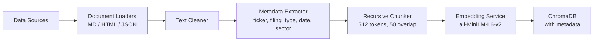

# TradeIQ Architecture

## System Overview

```mermaid
graph TB
    User[User] --> Frontend[Streamlit Frontend :8501]
    Frontend -->|HTTP| API[FastAPI Backend :8000]

    subgraph "RAG Pipeline"
        API --> QT[Query Transformer]
        QT -->|HyDE / Expansion| HS[Hybrid Search]
        HS --> VS[Vector Search<br>ChromaDB]
        HS --> BM[BM25 Sparse Search]
        VS --> RRF[Reciprocal Rank Fusion]
        BM --> RRF
        RRF --> RE[Cross-Encoder Reranker]
        RE --> CB[Context Builder]
        CB --> LLM[OpenAI gpt-4o-mini]
        LLM --> RP[Response Parser]
    end

    subgraph "Data Layer"
        Memory[(SQLite<br>Conversations)]
        VectorDB[(ChromaDB<br>Embeddings)]
    end

    CB --> Memory
    VS --> VectorDB
    RP --> API
```

## Ingestion Pipeline

## Data Sources

| Source | Type | Method |
|--------|------|--------|
| SEC 10-K/10-Q Filings | Real | EDGAR API |
| Earnings Call Transcripts | Synthetic | Generated with templates |
| Trading Strategies | Synthetic | Generated from public concepts |

## Retrieval Strategy

### Hybrid Search with Reciprocal Rank Fusion

1. **Dense Search**: Query embedding compared against document embeddings in ChromaDB using cosine similarity
2. **Sparse Search**: BM25 keyword matching (excellent for ticker symbols, financial terms)
3. **Fusion**: Reciprocal Rank Fusion (RRF) combines both ranked lists with configurable weighting (alpha=0.7 default)

### Cross-Encoder Reranking

After retrieval, a cross-encoder (`ms-marco-MiniLM-L-6-v2`) scores each (query, document) pair directly, providing more precise relevance ordering than bi-encoder similarity.

## API Endpoints

| Method | Path | Description |
|--------|------|-------------|
| POST | `/api/v1/query` | Main Q&A endpoint |
| POST | `/api/v1/ingest` | Ingest new documents |
| GET | `/api/v1/health` | Health check + system info |
| GET | `/api/v1/conversations` | List sessions |
| GET | `/api/v1/conversations/{id}` | Get history |
| DELETE | `/api/v1/conversations/{id}` | Clear session |
